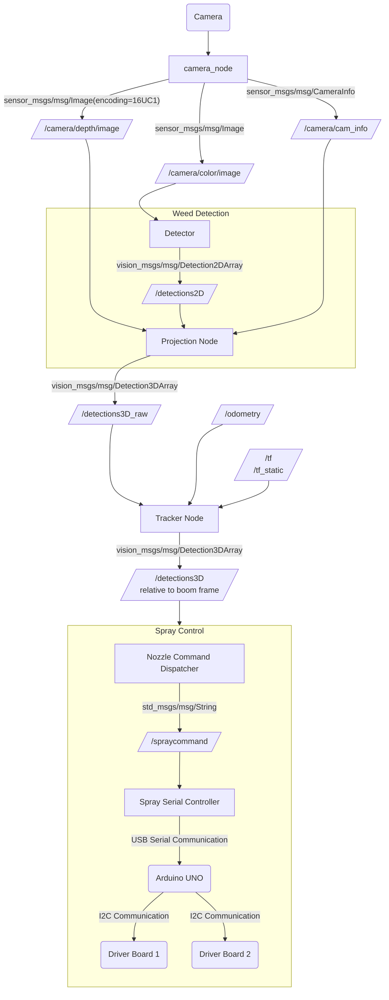

# Architecture

This document outlines the architecture of the LEAP Sprayer software stack,
especially what the component ROS nodes are and what their function is.

This document uses Mermaid diagrams to visualize parts of the architecture.
It is best viewed on GitHub or in an editor that supports Mermaid diagrams,
although Mermaid code is readable enough to understand without support.

## Detection Stack

The detection stack takes in camera images and robot motion to detect and track
weeds while driving.

### The Camera

The camera node publishes an image and a depth image.
This allows for supporting depth cameras to allow for more accuracy.
For monocular cameras, a decent assumption can be made by making
the depth image correspond to the distance to a flat floor plane.
If monocular needs to be used with better depth accuracy,
something like Depth Anything could estimate depth,
and thanks to the composability of the architecture,
it doesn't matter as long as depth images that correspond with a color image
share a timestamp to indicate this correspondence.

### Weed Detection

Weed detection could possibly be more complex than the above diagram,
using data like the depth image to detect more accurately.
So long as the outputs are 3D bounding box relative to the robot frame,
this implementation can remain opaque to the rest of the system.

As of right now, our explored approaches utilize just color images
when detecting and segmenting weeds, so by adding the depth information
separately, these pipelines can remain unaware of the depth information.
The 3D Bounding node will just use the segmented pixels and their corresponding depth values to estimate the bounding box.

### Tracker

This node ingests the 3D bounding boxes found on each frame
and uses knowledge of past detections to extrapolate the positions of weeds
as the robot moves, even as weeds may move out of view
(notably, they may leave view before reaching the sprayer).

This step also helps denoise the data using its knowledge of expected positions
and the robot's velocity.

### Nozzle Commands

We use a custom text-based format for nozzle commands.
It is documented below.

<table>
    <thead>
        <tr>
            <th colspan="6">Command</th>
            <th colspan="2">Description</th>
        </tr>
    </thead>
    <tbody>
        <tr>
            <td rowspan="6">N</td>
            <td colspan="4">X</td>
            <td rowspan="6"><code>\n</code></td>
            <td colspan="2">
                Turns off all nozzles
            </td>
        </tr>
        <tr>
            <td rowspan="4">S</td>
            <td colspan="3">L</td>
            <td colspan="2">
                Left spot sprayer. 🚧
            </td>
        </tr>
        <tr>
            <td rowspan="2">C</td>
            <td>&lt;id&gt; 0&ndash;3</td>
            <td>0</td>
            <td colspan="2">
                Center spot boom nozzle &lt;id&gt; off
            </td>
        </tr>
        <tr>
            <td>&lt;id&gt; 0&ndash;3</td>
            <td>1</td>
            <td colspan="2">
                Center spot boom nozzle &lt;id&gt; on
            </td>
        </tr>
        <tr>
            <td colspan="3">R</td>
            <td colspan="2">
                Right spot sprayer. 🚧
            </td>
        </tr>
        <tr>
            <td colspan="4">B</td>
            <td colspan="2">
                Broadcast sprayer. 🚧
            </td>
        </tr>
    </tbody>
</table>

See [`./src/spray_serialctrl/spray_serialctrl/serialcontroller.py`](./src/spray_serialctrl/spray_serialctrl/serialcontroller.py)
for a Python implementation of this as a validation function.
